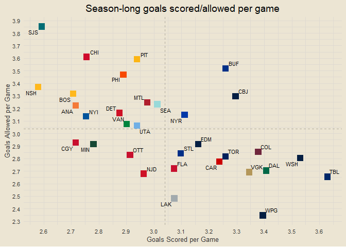
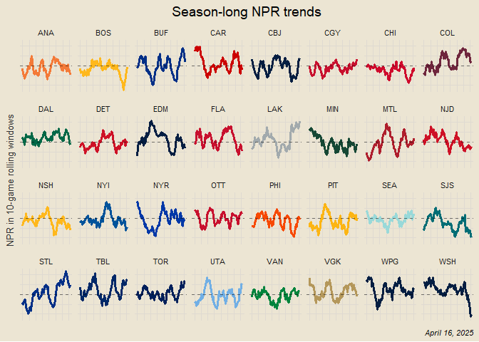
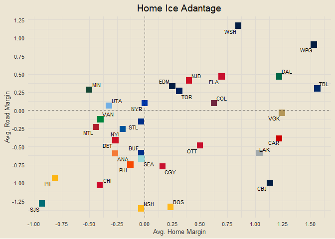
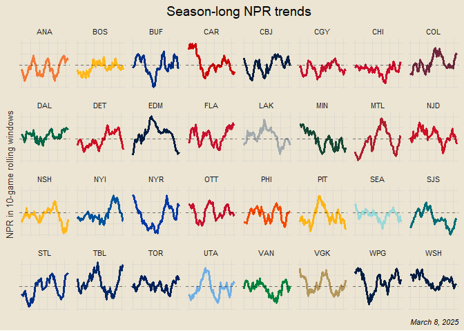

NHL 2025
================

------------------------------------------------------------------------

``` r
team_hex = data.frame(
  team_abbr = c("ANA", "BOS", "BUF", "CAR", "CBJ", "CGY", "CHI", "COL",
                "DAL", "DET", "EDM", "FLA", "LAK", "MIN", "MTL", "NJD",
                "NSH", "NYI", "NYR", "OTT", "PHI", "PIT", "SEA", "SJS",
                "STL", "TBL", "TOR", "UTA", "VAN", "VGK", "WPG", "WSH"),
  team_hex = c("#F47A38", "#FFB81C", "#002F87", "#CC0000",
               "#041E42", "#C8102E", "#CF0A2C", "#6F263D",
               "#006847", "#CE1126", "#041E42", "#C8102E",
               "#A2AAAD", "#154734", "#AF1E2D", "#CE1126",
               "#FFB81C", "#00539B", "#0038A8", "#C8102E",
               "#F74902", "#FCB514", "#99D9D9", "#006D75",
               "#002F87", "#002868", "#00205B", "#71AFE5",
               "#00843D", "#B4975A", "#041E42", "#041E42")
)
```

``` r
url = "https://api-web.nhle.com/v1/standings/now"
response = GET(url)
data = content(response, as = "text", encoding = "UTF-8") |> fromJSON()

standings = data$standings |>
  as.data.frame() |>
  clean_names() |>
  mutate(city_name = place_name$default,
         team_name = team_common_name$default,
         team_abbr = team_abbrev$default) |>
  inner_join(team_hex, by = "team_abbr") |>
  select(city_name, team_name, team_abbr, team_logo, team_hex,
         conference_name, division_name,
         games_played, goal_differential, goal_against, goal_for,
         home_wins, home_losses, home_ot_losses,
         home_goal_differential, home_goals_against, home_goals_for,
         road_wins, road_losses, road_ot_losses,
         road_goal_differential, road_goals_against, road_goals_for,
         wins, losses, ot_losses, points) |>
  mutate(gfpg = goal_for / games_played,
         gapg = goal_against / games_played)
```

``` r
standings |>
  ggplot(aes(gfpg, gapg)) +
  geom_point(aes(col = team_abbr), shape = "square", size = 4, show.legend = F) +
  scale_color_manual(values = team_hex$team_hex) +
  ggrepel::geom_text_repel(aes(label = team_abbr), size = 3) +
  geom_vline(xintercept = mean(standings$gfpg), linetype = "dashed", alpha = 0.25) +
  geom_hline(yintercept = mean(standings$gapg), linetype = "dashed", alpha = 0.25) +
  labs(x = "Goals Scored per Game", y = "Goals Allowed per Game", title = "Season-long goals scored/allowed per game") +
  scale_x_continuous(breaks = seq(0, 5, by = 0.1)) +
  scale_y_continuous(breaks = seq(0, 5, by = 0.1))
```

<!-- -->

``` r
standings |>
  mutate(py = (goal_for ^ 2) / (goal_for ^ 2 + goal_against ^ 2)) |>
  ggplot(aes(points, py)) +
  geom_point(aes(col = team_abbr), shape = "square", size = 4, show.legend = F) +
  geom_line(stat = "smooth", formula = y ~ x, method = "loess", linetype = "dashed", alpha = 0.5) +
  ggrepel::geom_text_repel(aes(label = team_abbr), size = 3, max.overlaps = 32) +
  scale_color_manual(values = team_hex$team_hex) +
  scale_x_continuous(breaks = seq(0, 100, by = 5)) +
  scale_y_continuous(breaks = seq(0, 1, by = 0.05), labels = scales::percent) +
  labs(x = "Points", y = "Pythagorean win percentage",
       title = "Team points vs. pythagorean win percentage",
       subtitle = "Teams above/below dashed line are better/worse than their record per PWP")
```

<!-- -->

### new work

``` r
start_date = as.Date("2024-10-01")
end_date = as.Date("2025-04-15")
games = list()
current_date = start_date

while (current_date <= end_date) {
    url = paste0("https://api-web.nhle.com/v1/schedule/", format(current_date, "%Y-%m-%d"))
    response = GET(url)
    
    if (status_code(response) == 200) {
        data = content(response, as = "parsed", type = "application/json")
        game_week = data$gameWeek
        
        if (!is.null(game_week)) {
            for (game_day in game_week) {
                for (game in game_day$games) {
                    if (game$gameType == 2) {
                        utc_time = game$startTimeUTC
                        
                        if (!is.null(utc_time)) {
                            utc_time_obj = ymd_hms(utc_time, tz = "UTC")
                            game_date = format(with_tz(utc_time_obj, "America/New_York"), "%Y-%m-%d")
                        } else {
                            game_date = NA
                        }
                        
                        home_score = as.integer(game$homeTeam$score %||% 0)
                        away_score = as.integer(game$awayTeam$score %||% 0)
                        
                        game_outcome = game$gameOutcome
                        overtime = ifelse(!is.null(game_outcome) && game_outcome$lastPeriodType %in% c("OT", "SO"), TRUE, FALSE)
                        
                        games = append(games, list(data.frame(
                            game_id = game$id,
                            game_date = game_date,
                            home_team = game$homeTeam$abbrev,
                            away_team = game$awayTeam$abbrev,
                            home_score = home_score,
                            away_score = away_score,
                            total_score = home_score + away_score,
                            overtime = overtime,
                            venue = game$venue$default
                        )))
                    }
                }
            }
        }
    }
    
    current_date = current_date + days(1)
}

games_df = bind_rows(games) |>
    filter(total_score > 0) |>
    distinct() |>
    mutate(game_date = as.Date(game_date, format = "%Y-%m-%d"))
```

``` r
all_teams = sort(unique(c(games_df$home_team, games_df$away_team)))

get_team_gspg = function(tm) {
  home = games_df |> filter(home_team == tm) |> pull(home_score)
  away = games_df |> filter(away_team == tm) |> pull(away_score)
  return(round(mean(c(home, away)), 3))
}

get_team_gapg = function(tm) {
  home = games_df |> filter(home_team == tm) |> pull(away_score)
  away = games_df |> filter(away_team == tm) |> pull(home_score)
  return(round(mean(c(home, away)), 3))
}

team_gpg = data.frame(team = all_teams) |>
  mutate(gspg = sapply(team, get_team_gspg),
         gapg = sapply(team, get_team_gapg))

end_npr = games_df |>
  inner_join(team_gpg, by = c("home_team" = "team")) |>
  rename(home_gspg = gspg, home_gapg = gapg) |>
  inner_join(team_gpg, by = c("away_team" = "team")) |>
  rename(away_gspg = gspg, away_gapg = gapg) |>
  mutate(home_exp = (home_gspg + away_gapg) / 2,
         away_exp = (away_gspg + home_gapg) / 2,
         home_off_npr = home_score - home_exp,
         home_def_npr = away_exp - away_score,
         away_off_npr = away_score - away_exp,
         away_def_npr = home_exp - home_score)

get_team_off_npr = function(tm) {
  home = end_npr |> filter(home_team == tm) |> pull(home_off_npr)
  away = end_npr |> filter(away_team == tm) |> pull(away_off_npr)
  return(round(mean(c(home, away)), 3))
}

get_team_def_npr = function(tm) {
  home = end_npr |> filter(home_team == tm) |> pull(home_def_npr)
  away = end_npr |> filter(away_team == tm) |> pull(away_def_npr)
  return(round(mean(c(home, away)), 3))
}

team_npr = data.frame(team = all_teams) |>
  mutate(off_npr = sapply(team, get_team_off_npr),
         def_npr = sapply(team, get_team_def_npr),
         ovr_npr = off_npr + def_npr)

team_npr |>
  ggplot(aes(off_npr, def_npr)) +
  geom_point(aes(col = team), shape = "square", size = 4, show.legend = F) +
  ggrepel::geom_text_repel(aes(label = team), size = 3, max.overlaps = 32) +
  geom_vline(xintercept = 0, linetype = "dashed", alpha = 0.5) +
  geom_hline(yintercept = 0, linetype = "dashed", alpha = 0.5) +
  geom_abline(linetype = "dashed", alpha = 0.25) +
  scale_x_continuous(breaks = seq(-0.5, 0.5, by = 0.05)) +
  scale_y_continuous(breaks = seq(-0.5, 0.5, by = 0.05)) +
  scale_color_manual(values = team_hex$team_hex) +
  labs(x = "Offensive NPR", y = "Defensive NPR",
       title = "Team Offensive/Defensive NPR",
       subtitle = "Teams above/below diagonal line are better defensively/offensively")
```

<!-- -->

``` r
team_npr |>
  inner_join(standings, by = c("team" = "team_abbr")) |>
  ggplot(aes(points, ovr_npr)) +
  geom_point(aes(col = team), shape = "square", size = 4, show.legend = F) +
  ggrepel::geom_text_repel(aes(label = team), size = 3, max.overlaps = 32) +
  geom_line(stat = "smooth", formula = y ~ x, method = "lm", linetype = "dashed", alpha = 0.5) +
  scale_color_manual(values = team_hex$team_hex) +
  labs(x = "Points", y = "NPR", title = "Team Points vs. NPR",
       subtitle = "Teams above/below line are better/worse than their record suggests") +
  scale_x_continuous(breaks = seq(0, 100, by = 5)) +
  scale_y_continuous(breaks = seq(-1, 1, by = 0.1))
```

<!-- -->

``` r
get_team_off_npr_on_date = function(tm, dt) {
  home = end_npr |> filter(game_date <= dt & home_team == tm) |> pull(home_off_npr)
  away = end_npr |> filter(game_date <= dt & away_team == tm) |> pull(away_off_npr)
  return(round(mean(c(home, away)), 3))
}

get_team_def_npr_on_date = function(tm, dt) {
  home = end_npr |> filter(game_date <= dt & home_team == tm) |> pull(home_def_npr)
  away = end_npr |> filter(game_date <= dt & away_team == tm) |> pull(away_def_npr)
  return(round(mean(c(home, away)), 3))
}

all_szn_dates = sort(unique(end_npr$game_date))

npr_on_dates = crossing(date = all_szn_dates, team = all_teams) |>
  rowwise() |>
  mutate(off_npr_on_date = get_team_off_npr_on_date(team, date),
         def_npr_on_date = get_team_def_npr_on_date(team, date)) |>
  ungroup() |>
  filter(!is.na(off_npr_on_date) & !is.na(def_npr_on_date))

npr_on_dates |>
  mutate(roll_off = rollapply(off_npr_on_date, FUN = "mean", width = 5, align = "right", fill = NA),
         roll_def = rollapply(def_npr_on_date, FUN = "mean", width = 5, align = "right", fill = NA)) |>
  filter(!is.na(roll_off) & !is.na(roll_def)) |>
  ggplot(aes(date, roll_off)) +
  geom_line(aes(col = team), show.legend = F) +
  scale_color_manual(values = team_hex$team_hex) +
  labs(title = "ignore this one but it looks kinda cool i guess")
```

<!-- -->

``` r
roll_width = 10

games_df |>
  select(game_date, team = home_team, team_score = home_score, opp_score = away_score) |>
  bind_rows(games_df |>
  select(game_date, team = away_team, team_score = away_score, opp_score = home_score)) |>
  arrange(team, game_date) |>
  mutate(roll_score = rollapply(team_score, width = roll_width, FUN = "mean", align = "right", fill = NA),
         roll_allow = rollapply(opp_score, width = roll_width, FUN = "mean", align = "right", fill = NA)) |>
  filter(!is.na(roll_score) & !is.na(roll_allow)) |>
  mutate(py = (roll_score ^ 2) / (roll_score ^ 2 + roll_allow ^ 2)) |>
  filter(team %in% c("CHI", "CAR", "COL", "WPG", "WSH", "TBL")) |>
  ggplot(aes(game_date, py)) +
  geom_line(aes(col = team), linewidth = 2, show.legend = T) +
  geom_hline(yintercept = 0.5, linetype = "dashed", alpha = 0.5) +
  scale_color_manual(values = c("red", "gold", "maroon", "lightblue", "navy", "pink")) +
  scale_y_continuous(breaks = seq(-1, 1, by = 0.05)) +
  labs(x = NULL, y = "Pythagorean win percentage", col = NULL,
       title = glue("Season-long pythagorean win percentage in {roll_width}-game rolling windows"))
```

<!-- -->

``` r
diff_df = games_df |>
  select(game_date, team = home_team, team_score = home_score, opp_score = away_score) |>
  bind_rows(games_df |>
  select(game_date, team = away_team, team_score = away_score, opp_score = home_score)) |>
  arrange(team, game_date) |>
  group_by(team) |>
  mutate(game_num = row_number()) |>
  ungroup() |>
  inner_join(npr_on_dates, by = c("game_date" = "date", "team")) |>
  mutate(ovr_npr_on_date = off_npr_on_date + def_npr_on_date) |>
  group_by(team) |>
  mutate(lag10 = lag(ovr_npr_on_date, n = 10, default = NA)) |>
  ungroup() |>
  filter(!is.na(lag10)) |>
  group_by(team) |>
  slice_max(game_num, n = 1) |>
  ungroup() |>
  mutate(diff = ovr_npr_on_date - lag10) |>
  arrange(desc(diff))

diff_df |>
  ggplot(aes(x = reorder(paste0(team, " (", round(diff, 2), ")"), ovr_npr_on_date), 
             xend = reorder(paste0(team, " (", round(diff, 2), ")"), ovr_npr_on_date), 
             y = lag10, yend = ovr_npr_on_date, col = diff)) + 
  geom_segment(linewidth = 3, show.legend = F) +
  geom_text(aes(y = ovr_npr_on_date, 
                label = ifelse(diff >= 0, "→", "")), 
            size = 4, hjust = -0.2, vjust = 0.25, color = "black", alpha = 0.75) +  
  geom_text(aes(y = ovr_npr_on_date, 
                label = ifelse(diff <= 0, "←", "")), 
            size = 4, hjust = 1.2, vjust = 0.25, color = "black", alpha = 0.75) +  
  coord_flip() +
  labs(x = NULL, y = "Change in NPR",
       title = "Team NPR Trends in Past Ten Games") +
  scale_y_continuous(breaks = seq(-5, 5, by = 0.1)) +
  scale_color_gradient(low = "indianred3", high = "springgreen4")
```

<!-- -->

``` r
games_df |>
  transmute(team = home_team, home_margin = home_score - away_score) |>
  group_by(team) |>
  summarise(avg_home_margin = mean(home_margin)) |>
  inner_join(games_df |>
  transmute(team = away_team, away_margin = away_score - home_score) |>
  group_by(team) |>
  summarise(avg_away_margin = mean(away_margin)), by = "team") |>
  ggplot(aes(avg_home_margin, avg_away_margin)) +
  geom_point(aes(col = team), shape = "square", size = 4, show.legend = F) +
  geom_vline(xintercept = 0, linetype = "dashed", alpha = 0.5) +
  geom_hline(yintercept = 0, linetype = "dashed", alpha = 0.5) +
  scale_color_manual(values = team_hex$team_hex) +
  ggrepel::geom_text_repel(aes(label = team), size = 3, max.overlaps = 32) +
  labs(x = "Avg. Home Margin", y = "Avg. Road Margin",
       title = "Home Ice Adantage") +
  scale_x_continuous(breaks = seq(-2, 2, by = 0.25)) +
  scale_y_continuous(breaks = seq(-2, 2, by = 0.25))
```

<!-- -->

``` r
end_npr |>
  transmute(team = home_team, home_npr = home_off_npr + home_def_npr) |>
  group_by(team) |>
  summarise(avg_home_margin = mean(home_npr)) |>
  inner_join(end_npr |>
  transmute(team = away_team, away_npr = away_off_npr + away_def_npr) |>
  group_by(team) |>
  summarise(avg_away_margin = mean(away_npr)), by = "team") |>
  ggplot(aes(avg_home_margin, avg_away_margin)) +
  geom_point(aes(col = team), shape = "square", size = 4, show.legend = F) +
  geom_vline(xintercept = 0, linetype = "dashed", alpha = 0.5) +
  geom_hline(yintercept = 0, linetype = "dashed", alpha = 0.5) +
  scale_color_manual(values = team_hex$team_hex) +
  ggrepel::geom_text_repel(aes(label = team), size = 3, max.overlaps = 32) +
  labs(x = "Avg. Home NPR", y = "Avg. Road NPR",
       title = "Home Ice Merchants") +
  scale_x_continuous(breaks = seq(-2, 2, by = 0.25)) +
  scale_y_continuous(breaks = seq(-2, 2, by = 0.25))
```

<!-- -->

``` r
end_npr = end_npr |>
  mutate(home_npr = home_off_npr + home_def_npr,
         away_npr = away_off_npr + away_def_npr)

sl_npr_trends = end_npr |>
  select(game_date, team = home_team, npr = home_npr) |>
  bind_rows(end_npr |>
  select(game_date, team = away_team, npr = away_npr)) |>
  arrange(team, game_date) |>
  group_by(team) |>
  mutate(game_num = row_number(),
         roll_npr = rollapply(npr, width = 10, align = "right", FUN = "mean", fill = NA)) |>
  ungroup() |>
  filter(!is.na(roll_npr))

sl_npr_trends |>
  ggplot(aes(game_num, roll_npr)) +
  geom_line(aes(col = team), linewidth = 1.25, show.legend = F) +
  geom_hline(yintercept = 0, linetype = "dashed", alpha = 0.5) +
  scale_color_manual(values = team_hex$team_hex) +
  facet_wrap(vars(team), scales = "free_x", nrow = 4) +
  theme(axis.text = element_blank()) +
  scale_y_continuous(breaks = seq(-2, 2, by = 2)) +
  labs(x = NULL, y = "NPR in 10-game rolling windows", title = "Season-long NPR trends",
       caption = paste0(month(Sys.Date(), label = T, abbr = F), " ", day(Sys.Date()), ", ", year(Sys.Date())))
```

<!-- -->

``` r
team_gpg |>
  mutate(gspg_scaled = scale(gspg),
         gapg_scaled = scale(gapg),
         full = gspg_scaled - gapg_scaled) |>
  arrange(desc(full))
```

    ##    team  gspg  gapg  gspg_scaled gapg_scaled       full
    ## 1   WPG 3.586 2.379  1.835264942 -1.89463350  3.7298984
    ## 2   WSH 3.702 2.561  2.210444117 -1.35468706  3.5651312
    ## 3   TBL 3.589 2.750  1.844967851 -0.79397344  2.6389413
    ## 4   DAL 3.333 2.526  1.016986223 -1.45852291  2.4755091
    ## 5   NJD 3.085 2.475  0.214879021 -1.60982659  1.8247056
    ## 6   VGK 3.276 2.776  0.832630939 -0.71683824  1.5494692
    ## 7   CAR 3.281 2.807  0.848802455 -0.62486934  1.4736718
    ## 8   FLA 3.328 2.879  1.000814707 -0.41126415  1.4120789
    ## 9   EDM 3.298 2.895  0.903785610 -0.36379633  1.2675819
    ## 10  LAK 2.927 2.564 -0.296140890 -1.34578684  1.0496460
    ## 11  TOR 3.158 2.825  0.450983157 -0.57146804  1.0224512
    ## 12  COL 3.186 3.034  0.541543648  0.04858035  0.4929633
    ## 13  MIN 2.930 2.842 -0.286437980 -0.52103348  0.2345955
    ## 14  CBJ 3.316 3.281  0.962003068  0.78136480  0.1806383
    ## 15  OTT 2.807 2.825 -0.684257278 -0.57146804 -0.1127892
    ## 16  NYR 3.018 3.140 -0.001819296  0.36305465 -0.3648739
    ## 17  BUF 3.255 3.400  0.764710571  1.13440671 -0.3696961
    ## 18  DET 2.947 3.140 -0.231454825  0.36305465 -0.5945095
    ## 19  NYI 2.768 2.964 -0.810395104 -0.15909136 -0.6513037
    ## 20  UTA 2.810 3.034 -0.674554368  0.04858035 -0.7231347
    ## 21  VAN 2.754 3.000 -0.855675349 -0.05228877 -0.8033866
    ## 22  SEA 2.915 3.186 -0.334952529  0.49952463 -0.8344772
    ## 23  STL 2.759 3.034 -0.839503833  0.04858035 -0.8880842
    ## 24  CGY 2.696 2.982 -1.043264937 -0.10569007 -0.9375749
    ## 25  BOS 2.741 3.190 -0.897721291  0.51139158 -1.4091129
    ## 26  PHI 2.897 3.362 -0.393169987  1.02167064 -1.4148406
    ## 27  MTL 2.947 3.439 -0.231454825  1.25010952 -1.4815643
    ## 28  ANA 2.571 3.071 -1.447552841  0.15834968 -1.6059025
    ## 29  NSH 2.607 3.304 -1.331117925  0.84959979 -2.1807177
    ## 30  PIT 2.881 3.627 -0.444918839  1.80785639 -2.2527752
    ## 31  CHI 2.667 3.526 -1.137059731  1.50821579 -2.6452755
    ## 32  SJS 2.559 3.746 -1.486364480  2.16089830 -3.6472628

``` r
team_win_pct = standings |>
  transmute(team_abbr, win_pct = round(wins / (wins + losses) * 100, 2))

team_results = games_df |>
  select(team = home_team, opp = away_team, score = home_score, opp_score = away_score) |>
  bind_rows(games_df |>
  select(team = away_team, opp = home_team, score = away_score, opp_score = home_score)) |>
  inner_join(team_win_pct, by = c("team" = "team_abbr")) |>
  rename(team_win_pct = win_pct) |>
  inner_join(team_win_pct, by = c("opp" = "team_abbr")) |>
  rename(opp_win_pct = win_pct)

get_team_above_500_win_pct = function(tm) {
  f_games = team_results |> filter(team == tm & opp_win_pct >= 50)
  wins = f_games |> filter(score > opp_score)
  return(round(nrow(wins) / nrow(f_games) * 100, 2))
}

get_team_below_500_win_pct = function(tm) {
  f_games = team_results |> filter(team == tm & opp_win_pct < 50)
  wins = f_games |> filter(score > opp_score)
  return(round(nrow(wins) / nrow(f_games) * 100, 2))
}

team_500_wp = data.frame(team = all_teams) |>
  mutate(above500 = sapply(team, get_team_above_500_win_pct),
         below500 = sapply(team, get_team_below_500_win_pct))

team_500_wp |>
  ggplot(aes(above500, below500)) +
  geom_point(aes(col = team), shape = "square", size = 4, show.legend = F) +
  geom_vline(xintercept = 50, linetype = "dashed", alpha = 0.5) +
  geom_hline(yintercept = 50, linetype = "dashed", alpha = 0.5) +
  geom_abline(linetype = "dashed", alpha = 0.25) +
  scale_color_manual(values = team_hex$team_hex) +
  ggrepel::geom_text_repel(aes(label = team), size = 3, max.overlaps = 32) +
  labs(x = "Win Percentage vs. Teams with Above .500 Record",
       y = "Win Percentage vs. Teams with Below .500 Record",
       title = "Records vs. Above/Below .500 Opponents") +
  scale_x_continuous(breaks = seq(0, 100, by = 5)) +
  scale_y_continuous(breaks = seq(0, 100, by = 5))
```

<!-- -->
